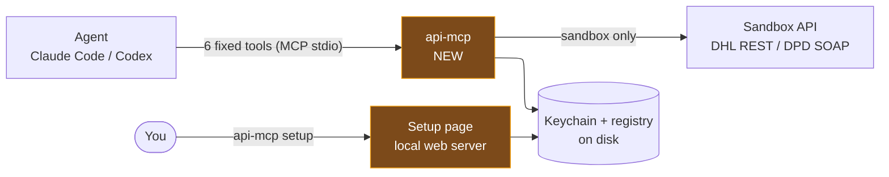
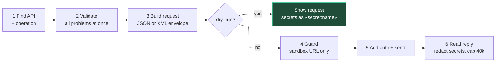
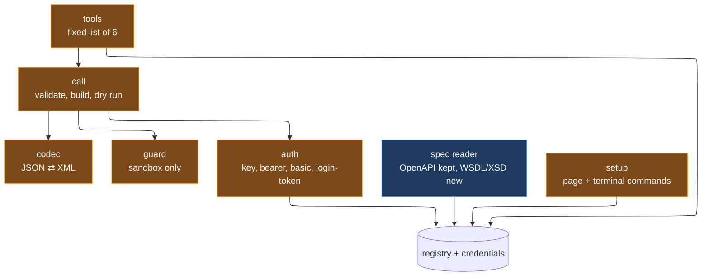
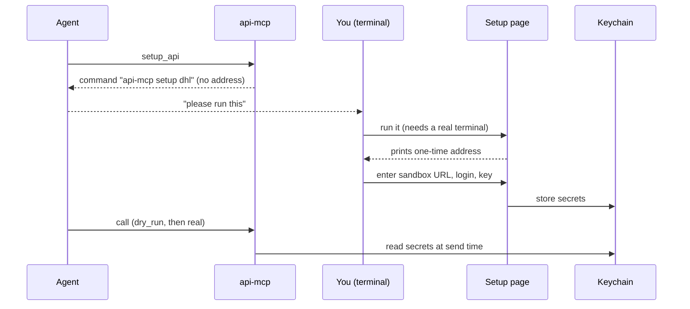

# Four api-mcp diagrams (test fixtures)

Copied from the 2026-11-08 test page; the checker tests start from these.

```mermaid
---
config:
  layout: elk
---
flowchart LR
  agent["Agent<br/>Claude Code / Codex"] -- "6 fixed tools (MCP stdio)" --> mcp["api-mcp<br/>NEW"]
  mcp -- "sandbox only" --> api["Sandbox API<br/>DHL REST / DPD SOAP"]
  human(["You"]) -- "api-mcp setup" --> page["Setup page<br/>local web server"]
  page --> store[("Keychain + registry<br/>on disk")]
  mcp --> store
  classDef new fill:#7c4a1a,stroke:#f59e0b,color:#fff
  class mcp,page new
```

```mermaid
---
config:
  layout: elk
---
flowchart LR
  a["1 Find API<br/>+ operation"] --> b["2 Validate<br/>all problems at once"] --> c["3 Build request<br/>JSON or XML envelope"] --> d{"dry_run?"}
  d -- yes --> p["Show request<br/>secrets as «secret:name»"]
  d -- no --> g["4 Guard<br/>sandbox URL only"] --> s["5 Add auth + send"] --> r["6 Read reply<br/>redact secrets, cap 40k"]
  classDef stop fill:#1f4d3a,stroke:#34d399,color:#fff
  class p stop
```

```mermaid
---
config:
  layout: elk
---
flowchart TB
  tools["tools<br/>fixed list of 6"] --> callTool["call<br/>validate, build, dry run"]
  callTool --> codec["codec<br/>JSON ⇄ XML"]
  callTool --> guard["guard<br/>sandbox only"]
  callTool --> auth["auth<br/>key, bearer, basic, login-token"]
  tools --> store[("registry + credentials")]
  auth --> store
  spec["spec reader<br/>OpenAPI kept, WSDL/XSD new"] --> store
  setup["setup<br/>page + terminal commands"] --> store
  classDef new fill:#7c4a1a,stroke:#f59e0b,color:#fff
  classDef old fill:#1e3a5f,stroke:#60a5fa,color:#fff
  class tools,callTool,codec,guard,auth,setup new
  class spec old
```

```mermaid
sequenceDiagram
  participant A as Agent
  participant M as api-mcp
  participant H as You (terminal)
  participant P as Setup page
  participant K as Keychain
  A->>M: setup_api
  M-->>A: command "api-mcp setup dhl" (no address)
  A-->>H: "please run this"
  H->>P: run it (needs a real terminal)
  P-->>H: prints one-time address
  H->>P: enter sandbox URL, login, key
  P->>K: store secrets
  A->>M: call (dry_run, then real)
  M->>K: read secrets at send time
```
